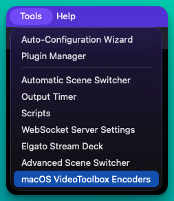
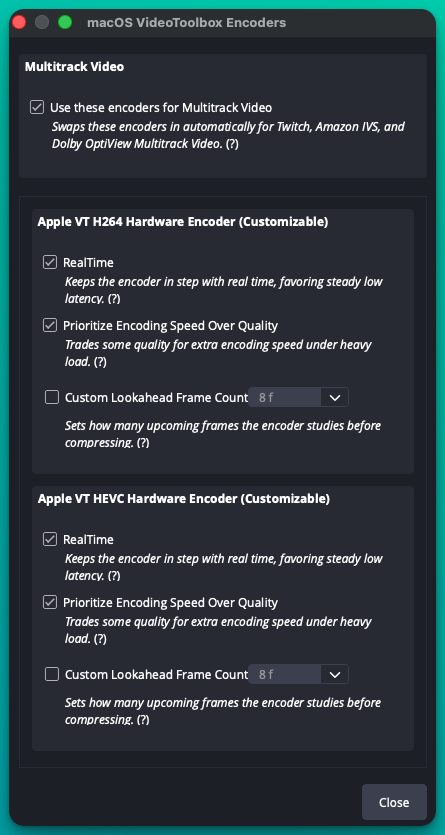
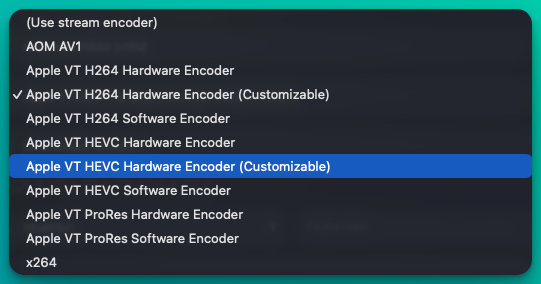

# OBS macOS VideoToolbox Customizable Encoders

A plugin for [OBS Studio](https://obsproject.com) on Mac that adds two extra
hardware encoders — **Apple VT H264 Hardware Encoder (Customizable)** and
**Apple VT HEVC Hardware Encoder (Customizable)** — plus a settings window to
tune their latency/quality trade-offs, and lets OBS use them automatically for
**Multitrack Video** streaming.

## Why would I want this?

OBS already ships Apple's VideoToolbox hardware encoders. This plugin adds
"Customizable" versions of the same H.264 and HEVC encoders that expose three
VideoToolbox settings OBS's own encoders don't:

- **RealTime** — asks the hardware encoder to keep pace with real time
  instead of taking extra time per frame. This is what streaming services
  expect from hardware encoders on live tracks.
- **Prioritize Encoding Speed Over Quality** — lets the encoder trade quality
  for extra speed if it's struggling to keep up.
- **Custom Lookahead Frame Count** (macOS 15 Sequoia or newer) — controls how
  many upcoming frames the encoder studies before compressing, which can claw
  back some of the quality RealTime mode gives up.

All three default to off, so a freshly installed Customizable encoder behaves
exactly like OBS's own native hardware encoder until you turn something on.
You configure them once, from **Tools → macOS VideoToolbox Encoders…**, for
each codec — the setting isn't per output or per profile, it applies to every
use of that encoder on this Mac.

This also lets OBS's **Multitrack Video** feature — used by Twitch Enhanced
Broadcasting, Amazon IVS Multitrack Video, and Dolby OptiView Real-time
Enhanced Broadcasting (also known as Dolby Millicast) — automatically pick
the Customizable encoder instead of the standard one, with no manual setup
per stream.

You can also select either Customizable encoder directly and use it like any
other encoder in OBS, for outputs outside of Multitrack Video.

## Requirements

- macOS 13 (Ventura) or newer, on a Mac with Apple Silicon (macOS 15 Sequoia
  or newer for the Custom Lookahead Frame Count setting)
- OBS Studio 31.1.0 or newer
- A Mac whose chip supports hardware H.264/HEVC encoding (all Apple Silicon
  Macs do)

## Installing

1. Download the latest `.pkg` installer from the
   [Releases](../../releases) page.
2. Double-click the downloaded file and follow the installer.
3. Restart OBS Studio if it was running.

The installer places the plugin in your user's OBS plugin folder, so it only
affects your own OBS installation — it does not require admin rights beyond
the standard installer prompt, and it does not touch OBS Studio itself.

### Uninstalling

Quit OBS, then delete this folder:

```text
~/Library/Application Support/obs-studio/plugins/obs-macos-videotoolbox-encoders.plugin
```

## Using it

### Configuring the encoders

Open OBS's **Tools** menu and choose **macOS VideoToolbox Encoders…**. The
window has a section for H264 and a section for HEVC, each with the same
three toggles described above, plus a separate section to enable using these
encoders for Multitrack Video. Every toggle shows a short description and a
tooltip with a more detailed explanation of what it does and when to use it.
These settings apply to this Mac, independent of the OBS profile in use.

<p align="center">
  
  
</p>

### As a Multitrack Video encoder (automatic)

Enable **Use these encoders for Multitrack Video** in the settings window.
The next time you start streaming with Multitrack Video enabled for a
supported service (Twitch, Amazon IVS, or Dolby OptiView), OBS swaps in the
Customizable encoder automatically for any track that was using Apple's
regular H.264/HEVC hardware encoder. Every other output or stream is left
untouched. If the Customizable encoder isn't available or compatible for some
reason, OBS quietly falls back to the encoder you already had selected —
streaming is never blocked by this.

### As a regular encoder (manual)

In **Settings → Output**, pick **Apple VT H264 Hardware Encoder
(Customizable)** or **Apple VT HEVC Hardware Encoder (Customizable)** from
the encoder list, the same way you'd pick any other encoder.



## Frequently asked questions

**Does this replace or modify OBS's own encoders?**
No. It adds two new encoders alongside the ones OBS already ships. Your
existing encoders and settings are never changed.

**Will this affect streams or recordings that don't use Multitrack Video?**
No. The automatic replacement only applies to Multitrack Video outputs for
the supported services, and only while that option is turned on in the
settings window. Everything else in OBS behaves exactly as before.

**What happens if the Customizable encoder can't be used for some reason?**
OBS falls back to the encoder it would have used anyway, so a stream never
fails to start because of this plugin.

**Should I turn RealTime on or off?**
On for live streaming, where a hardware encoder that reliably keeps up with
the incoming frame rate matters more than squeezing out the best possible
quality per bit — this is what Twitch, Amazon IVS, and Dolby OptiView expect.
Off (the default) for local recording or any non-latency-sensitive use, where
the encoder is free to spend more effort per frame; this matches how OBS's
own native hardware encoder already behaves.

**When would I need Prioritize Encoding Speed Over Quality or Custom
Lookahead Frame Count?**
Apple's hardware encoders already favor quality by default, even with
RealTime on, so most people never need to touch these. Turn on Prioritize
Encoding Speed Over Quality only if you see dropped or delayed frames at your
chosen resolution, bitrate, or frame rate. Custom Lookahead Frame Count is
the opposite knob — raising it can recover some of the quality RealTime mode
gives up, at the cost of a bit more latency and memory; it requires macOS 15
(Sequoia) or newer.

**Does this work on Intel Macs?**
The published installer targets Apple Silicon. Some rate-control modes (CBR,
CRF) require Apple Silicon and automatically fall back to ABR when they're
not available.

**Is this an official OBS or Apple product?**
No, it's an independent, open-source plugin. It uses only public OBS Studio
and Apple VideoToolbox APIs.

**How do I know which OBS version this supports?**
OBS Studio 31.1.0 or newer. The plugin checks the OBS version it's built
against and won't build against older versions.

## License

GPL-2.0. The encoder implementation is based on OBS Studio's GPL-licensed
VideoToolbox module.
